Numerai Financial Analysis
================
Last updated: 2024-01-20

## Preliminary Work: Install/Load Packages

Below is a list of R packages that will be used throughout this R
Notebook.

- The [fredr package](https://cran.r-project.org/package=fredr) is an R
  package that wraps the FRED API for easy importing of FRED data into
  R.
- The [quantmod package](https://cran.r-project.org/package=quantmod)
  contains tools for importing and analyzing financial data.
- The [readr package](https://cran.r-project.org/package=readr) is a
  package for reading in data files. We’ll use it to read in the csv
  file from the Numerai Fund website.
- The [xts package](https://cran.r-project.org/package=xts) is short for
  ‘eXtensible Time Series’, which contains tools for working with time
  series data.
- The [lubridate package](https://cran.r-project.org/package=lubridate)
  simplifies calculation involving dates.
- The [ggplot2 package](https://cran.r-project.org/package=ggplot2) for
  graphics and visuals.
- The [dplyr package](https://cran.r-project.org/package=dplyr) contains
  tools for data manipulation.

``` r
# Create list of packages needed for this exercise
list.of.packages = c("fredr","quantmod","readr","xts","lubridate","ggplot2","dplyr","rmarkdown")
# Check if any have not yet been installed
new.packages = list.of.packages[!(list.of.packages %in% installed.packages()[,"Package"])]
# If any need to be installed, install them
if(length(new.packages)) install.packages(new.packages)
# Load in the packages
library(fredr)
library(quantmod)
```

    ## Loading required package: xts

    ## Loading required package: zoo

    ## 
    ## Attaching package: 'zoo'

    ## The following objects are masked from 'package:base':
    ## 
    ##     as.Date, as.Date.numeric

    ## Loading required package: TTR

    ## Registered S3 method overwritten by 'quantmod':
    ##   method            from
    ##   as.zoo.data.frame zoo

``` r
library(readr)
library(xts)
library(lubridate)
```

    ## 
    ## Attaching package: 'lubridate'

    ## The following objects are masked from 'package:base':
    ## 
    ##     date, intersect, setdiff, union

``` r
library(ggplot2)
library(dplyr)
```

    ## 
    ## ######################### Warning from 'xts' package ##########################
    ## #                                                                             #
    ## # The dplyr lag() function breaks how base R's lag() function is supposed to  #
    ## # work, which breaks lag(my_xts). Calls to lag(my_xts) that you type or       #
    ## # source() into this session won't work correctly.                            #
    ## #                                                                             #
    ## # Use stats::lag() to make sure you're not using dplyr::lag(), or you can add #
    ## # conflictRules('dplyr', exclude = 'lag') to your .Rprofile to stop           #
    ## # dplyr from breaking base R's lag() function.                                #
    ## #                                                                             #
    ## # Code in packages is not affected. It's protected by R's namespace mechanism #
    ## # Set `options(xts.warn_dplyr_breaks_lag = FALSE)` to suppress this warning.  #
    ## #                                                                             #
    ## ###############################################################################

    ## 
    ## Attaching package: 'dplyr'

    ## The following objects are masked from 'package:xts':
    ## 
    ##     first, last

    ## The following objects are masked from 'package:stats':
    ## 
    ##     filter, lag

    ## The following objects are masked from 'package:base':
    ## 
    ##     intersect, setdiff, setequal, union

## Import and Clean Data

We will be collecting data from three different sources here. First,
we’ll import the monthly returns for the Numerai One and Numerai Supreme
hedge funds from the [Numerai Fund website](https://numerai.fund/).
Second, we’ll import the monthly returns for the S&P 500 index from the
[FRED website](https://fred.stlouisfed.org/). Lastly, we’ll import the
monthly returns for the Numeraire (NMR) token and Ether (ETH) from
[Yahoo Finance](https://finance.yahoo.com/) via the quantmod package.
The code below will import the data from each of these sources and clean
it up for analysis.

### Numerai Hedge Fund Performance Data

Due to their classification as hedge funds, there is far less
publicly-available information compared to mutual funds or ETFs.
However, since Numerai self-publishes data for monthly fund returns on
their webpage, we can make use of this to examine the performance and
test their claim of investing with a market-neutral strategy. To find
the url for the code chunk below, go to the main [fund
website](https://numerai.fund/) and right-click on “Download
Performance” and select “Copy link address.” If you left-click on the
link, most browsers will simply attempt to download the current csv
file. However, we can incorporate the static url into our script here
and access the csv with `read_csv()`. This should retrieve all the most
recent data each time this code is run.

``` r
url = "https://api-financial.numer.ai/get_lp_performance_csv"
fundrets = read_csv(url, show_col_types=FALSE)
```

Now, let’s take the monthly returns from the data and convert them to an
xts object of annualized percentages. Take note of the date conversion
in the `order.by` parameter. Since these dates are the last day of each
month, we add one date and subtract one month to convert the date to the
first day of each respective month. This is in anticipation of merging
with the FRED data that will be imported below, which uses dates at the
beginning of each month.

``` r
nmr = data.frame(nmr_one=fundrets$numerai_one_monthly_return_net_of_fees*12*100,
                     nmr_sup=fundrets$supreme_monthly_return_net_of_fees*12*100)
nmr = xts(nmr,
          order.by=fundrets$month_end_date + days(1) - months(1))
```

For the Numerai Supreme Fund, the data shows a 0% return prior to the
launch of the fund in August 2022. To avoid the models from actually
interpreting a 0% return, let’s replace those 0’s with missing values
`NA`. The xts package makes this easier by allowing us to index by time.
The `"/2022-07-01"` in the square brackets specifies the rows
corresponding to dates up to and including July 2022.

``` r
nmr$nmr_sup["/2022-07-01"] = NA
```

Then to simplify the download of the FRED data, let’s save the date of
the earliest observation to `startdate`. This will help us only download
the data that we will actually need for the analysis. Then,
`startdate_1` will go back one additional month for the FRED download
since we will lose an observation due to differencing. Similarly,
`startdate_2` will go back two months from `startdate`, which is what
downloads the correct amount of data for the crypto assets.

``` r
startdate = min(fundrets$month_end_date)
startdate_1 = startdate %m-% months(1)
startdate_2 = startdate %m-% months(2)
```

### FRED Data Import

To access the FRED API, you must first create an account and [request an
API key](https://fred.stlouisfed.org/docs/api/api_key.html). If you wish
to run the code and replicate the results, you’ll need to make an
account, generate your own API key, and run this command un-commented
with your key in place of the placeholder text.

``` r
#fredr_set_key("<YOUR-FRED-API-KEY>")
```

Using the `fredr()` function, we will import the 10-year Treasury note
yields. This is a typical proxy for the risk-free return when applying
CAPM and calculating stock betas. The Sys.Date function is simply using
the computer’s current time to get the most up-to-date data.

``` r
RFraw = fredr(
  series_id = "DGS10",
  observation_start = startdate,
  observation_end = as.Date(Sys.Date()),
  frequency = "m"
)
INFraw = fredr(
  series_id = "CPIAUCSL",
  observation_start = startdate_1,
  observation_end = as.Date(Sys.Date()),
  frequency = "m"
)
SPraw = fredr(
  series_id = "SP500",
  observation_start = startdate_1,
  observation_end = as.Date(Sys.Date()),
  frequency = "m"
)
```

Next, calculate the inflation rates from the CPI and merge those
annualized growth rates to the merged data frame.

``` r
INF = xts(INFraw,order.by=INFraw$date)
colnames(INF)[colnames(INF)=="value"] = "CPI"
INF = subset(INF,select=-c(date,series_id,realtime_start,realtime_end))
INF$INFmonthly = log(as.numeric(INF$CPI)) - log(as.numeric(lag(INF$CPI)))
INF$inf = INF$INFmonthly*12*100
```

Now convert the S&P 500 index levels into annualized market returns and
merge to `ALL`.

``` r
SP500 = xts(SPraw,order.by=SPraw$date)
colnames(SP500)[colnames(SP500)=="value"] = "SP500"
SP500 = subset(SP500,select=-c(date,series_id,realtime_start,realtime_end))
SP500$SPmonthly = log(as.numeric(SP500$SP500)) - log(as.numeric(lag(SP500$SP500)))
SP500$sp500 = SP500$SPmonthly*12*100
```

### NMR and ETH Price Data

In addition to the Numerai Fund data, let’s also import the price data
for the Numeraire (NMR) token and Ether (ETH), which is the native token
of the Ethereum blockchain that NMR transacts on.

``` r
tickers = c("ETH-USD",
            "NMR-USD")
getSymbols(tickers,
           src="yahoo",
           from=startdate_2,
           to=Sys.Date(),
           periodicity="monthly")
```

First, we’ll give the crypto data names that do not have a special
character (`-`), then we’ll compute the continuously compounded annual
returns for the monthly data series.

``` r
ETH = `ETH-USD`
NMR = `NMR-USD`
# Compute returns
ETH$Return = c(NA, diff(log(as.numeric(ETH$`ETH-USD.Adjusted`))))
NMR$Return = c(NA, diff(log(as.numeric(NMR$`NMR-USD.Adjusted`))))
# Annualize returns
ETH$ETH = ETH$Return*12*100
NMR$NMR = NMR$Return*12*100
```

### Merging and Cleaning

Now, let’s merge all these variables to a single data frame named `ALL`.

``` r
ALL = xts(RFraw,order.by=RFraw$date)
colnames(ALL)[colnames(ALL)=="value"] = "rf"
ALL = subset(ALL,select=-c(date,series_id,realtime_start,realtime_end))
ALL = merge(ALL,
            INF$inf,
            SP500$sp500,
            nmr$nmr_one,
            nmr$nmr_sup,
            NMR$NMR,
            ETH$ETH)
```

Then the last cleaning step is to remove any missing values. The
`complete.cases()` function returns the indices (rows) of observations
with no missing values.

``` r
ntrim = sum(!complete.cases(tail(ALL)))
FINAL = ALL[2:(nrow(ALL)-ntrim),]
```

## Data Summaries and Plots

When summarizing and visualizing the asset returns, we’ll begin with the
nominal returns. Then we’ll examine the real (inflation-adjusted) return
series. Lastly, we’ll convert each of those return series into risk
premiums, resulting in a nominal risk premium and a real risk premium.
Then we can compare those two sets of results to see the impact of
inflation on the observed relationships.

### Nominal Returns

Let’s first take a look at what each time series looks like:

``` r
ggplot(FINAL,aes(x=Index,y=rf))+
  geom_col()+
  ggtitle("Risk-Free Asset Returns")
```

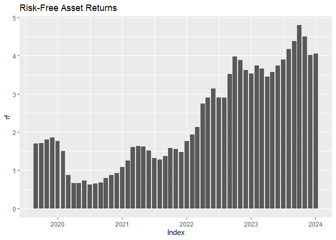<!-- -->

``` r
ggplot(FINAL,aes(x=Index,y=inf))+
  geom_col()+
  ggtitle("Annualized Inflation Rates")
```

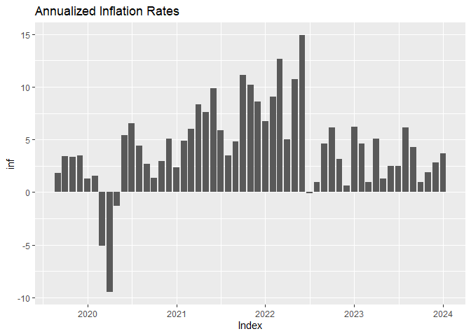<!-- -->

``` r
ggplot(FINAL,aes(x=Index,y=sp500))+
  geom_col()+
  ggtitle("S&P 500 Returns")
```

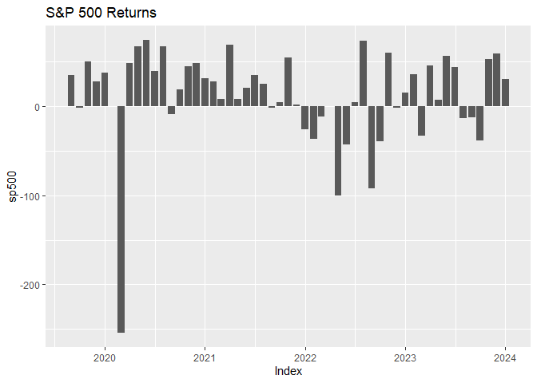<!-- -->

``` r
ggplot(FINAL,aes(x=Index,y=nmr_one))+
  geom_col()+
  ggtitle("Numerai One Returns")
```

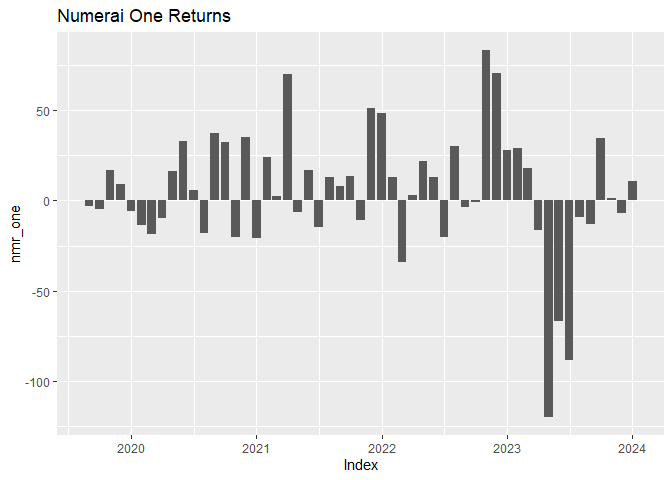<!-- -->

``` r
ggplot(FINAL,aes(x=Index,y=nmr_sup))+
  geom_col()+
  ggtitle("Numerai Supreme Returns")
```

    ## Warning: Removed 35 rows containing missing values (`position_stack()`).

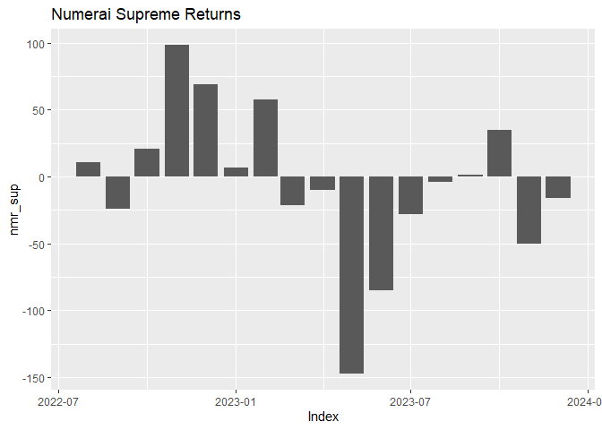<!-- -->

``` r
ggplot(FINAL,aes(x=Index,y=NMR))+
  geom_col()+
  ggtitle("Numeraire (NMR) Returns")
```

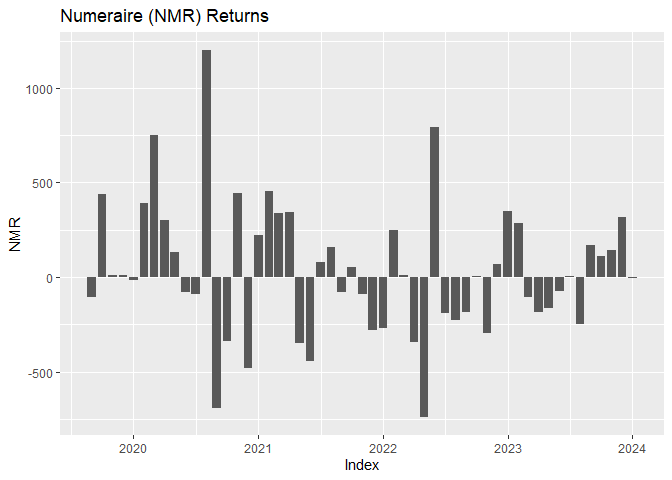<!-- -->

``` r
ggplot(FINAL,aes(x=Index,y=ETH))+
  geom_col()+
  ggtitle("Ether (ETH) Returns")
```

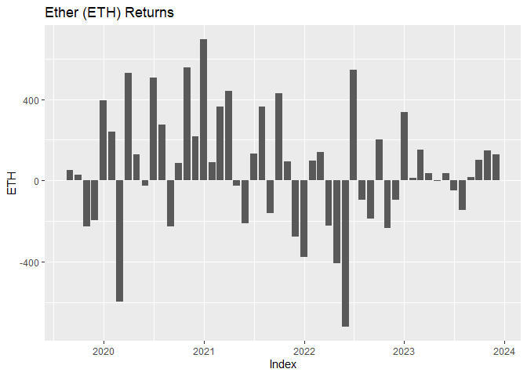<!-- -->

Next, let’s calculate the average annual return (mean) and volatility
(standard deviation).

``` r
Er_nom = colMeans(FINAL,na.rm=TRUE)
Er_nom |> round(2)
```

    ##      rf     inf   sp500 nmr_one nmr_sup     NMR     ETH 
    ##    2.27    4.33   11.09    4.89   -5.04   33.74   59.59

``` r
sigma_nom = apply(FINAL,2,sd,na.rm=TRUE)
sigma_nom |> round(2)
```

    ##      rf     inf   sp500 nmr_one nmr_sup     NMR     ETH 
    ##    1.26    4.08   54.21   35.17   57.38  357.80  293.51

Then let’s compare the correlations across all these asset returns:

``` r
Rho = cor(FINAL, use="pairwise.complete.obs")
Rho |> round(2)
```

    ##            rf   inf sp500 nmr_one nmr_sup   NMR   ETH
    ## rf       1.00  0.03 -0.10   -0.13    0.08 -0.10 -0.21
    ## inf      0.03  1.00  0.00    0.17    0.17 -0.15 -0.22
    ## sp500   -0.10  0.00  1.00    0.04   -0.01 -0.04  0.47
    ## nmr_one -0.13  0.17  0.04    1.00    0.88 -0.15 -0.16
    ## nmr_sup  0.08  0.17 -0.01    0.88    1.00  0.13 -0.20
    ## NMR     -0.10 -0.15 -0.04   -0.15    0.13  1.00  0.22
    ## ETH     -0.21 -0.22  0.47   -0.16   -0.20  0.22  1.00

### Real Returns

To calculate real returns from the nominal returns, we must subtract the
inflation rate, and then divide the difference by the quantity of
(1+inflation). Note that the inflation percentage must be divided by 100
to convert back to a decimal.

``` r
REAL = xts(order.by=index(FINAL))
REAL$rf = (FINAL$rf-FINAL$inf)/(1+(FINAL$inf/100))
REAL$sp500 = (FINAL$sp500-FINAL$inf)/(1+(FINAL$inf/100))
REAL$nmr_one = (FINAL$nmr_one-FINAL$inf)/(1+(FINAL$inf/100))
REAL$nmr_sup = (FINAL$nmr_sup-FINAL$inf)/(1+(FINAL$inf/100))
REAL$NMR = (FINAL$NMR-FINAL$inf)/(1+(FINAL$inf/100))
REAL$ETH = (FINAL$ETH-FINAL$inf)/(1+(FINAL$inf/100))
```

Now let’s compare the means, standard deviations, and correlations for
these inflation-adjusted return series:

``` r
Er_real = colMeans(REAL,na.rm=TRUE)
Er_real |> round(2)
```

    ##      rf   sp500 nmr_one nmr_sup     NMR     ETH 
    ##   -1.82    6.60    0.46   -8.25   30.56   55.57

``` r
sigma_real = apply(REAL,2,sd,na.rm=TRUE)
sigma_real |> round(2)
```

    ##      rf   sp500 nmr_one nmr_sup     NMR     ETH 
    ##    4.05   54.25   33.62   55.93  342.06  283.65

``` r
Rho_real = cor(REAL, use="pairwise.complete.obs")
Rho_real |> round(2)
```

    ##            rf sp500 nmr_one nmr_sup   NMR   ETH
    ## rf       1.00  0.01   -0.10   -0.12  0.15  0.16
    ## sp500    0.01  1.00    0.04   -0.02 -0.06  0.50
    ## nmr_one -0.10  0.04    1.00    0.88 -0.14 -0.13
    ## nmr_sup -0.12 -0.02    0.88    1.00  0.12 -0.21
    ## NMR      0.15 -0.06   -0.14    0.12  1.00  0.22
    ## ETH      0.16  0.50   -0.13   -0.21  0.22  1.00

### Risk Premiums

Then to normalize risk by the risk-free rate, we can difference each
return series by the risk-free rate to compute risk premiums (or excess
returns). This can be done with the nominal returns or the real returns.
So let’s do each and compare how inflation-adjusting the returns impacts
the results.

``` r
XSnom = xts(order.by=index(FINAL))
XSnom$sp500 = FINAL$sp500-FINAL$rf
XSnom$nmr_one = FINAL$nmr_one-FINAL$rf
XSnom$nmr_sup = FINAL$nmr_sup-FINAL$rf
XSnom$NMR = FINAL$NMR-FINAL$rf
XSnom$ETH = FINAL$ETH-FINAL$rf
```

``` r
XSreal = xts(order.by=index(REAL))
XSreal$sp500 = REAL$sp500-REAL$rf
XSreal$nmr_one = REAL$nmr_one-REAL$rf
XSreal$nmr_sup = REAL$nmr_sup-REAL$rf
XSreal$NMR = REAL$NMR-REAL$rf
XSreal$ETH = REAL$ETH-REAL$rf
```

For each set of risk premiums, let’s compute the average annual returns
and volatilities, as well as the correlation matrices to see how much
the fund returns co-move with the market returns of the S&P 500.

``` r
xsEr_nom = colMeans(XSnom, na.rm=TRUE)
xsEr_nom |> round(2)
```

    ##   sp500 nmr_one nmr_sup     NMR     ETH 
    ##    8.82    2.62   -8.89   31.47   57.32

``` r
xssigma_nom = apply(XSnom, 2, sd, na.rm=TRUE)
xssigma_nom |> round(2)
```

    ##   sp500 nmr_one nmr_sup     NMR     ETH 
    ##   54.35   35.35   57.34  357.93  293.78

``` r
xsRho_nom = cor(XSnom, use="pairwise.complete.obs")
xsRho_nom |> round(2)
```

    ##         sp500 nmr_one nmr_sup   NMR   ETH
    ## sp500    1.00    0.05   -0.01 -0.04  0.48
    ## nmr_one  0.05    1.00    0.88 -0.15 -0.15
    ## nmr_sup -0.01    0.88    1.00  0.12 -0.20
    ## NMR     -0.04   -0.15    0.12  1.00  0.22
    ## ETH      0.48   -0.15   -0.20  0.22  1.00

``` r
xsEr_real = colMeans(XSreal, na.rm=TRUE)
xsEr_real |> round(2)
```

    ##   sp500 nmr_one nmr_sup     NMR     ETH 
    ##    8.42    2.28   -8.79   32.38   57.39

``` r
xssigma_real = apply(XSreal, 2, sd, na.rm=TRUE)
xssigma_real |> round(2)
```

    ##   sp500 nmr_one nmr_sup     NMR     ETH 
    ##   54.36   34.26   56.22  341.47  283.02

``` r
xsRho_real = cor(XSreal, use="pairwise.complete.obs")
xsRho_real |> round(2)
```

    ##         sp500 nmr_one nmr_sup   NMR   ETH
    ## sp500    1.00    0.05   -0.01 -0.07  0.49
    ## nmr_one  0.05    1.00    0.88 -0.15 -0.15
    ## nmr_sup -0.01    0.88    1.00  0.12 -0.21
    ## NMR     -0.07   -0.15    0.12  1.00  0.21
    ## ETH      0.49   -0.15   -0.21  0.21  1.00

## Sharpe Ratios and CAPM Betas

From the risk premiums, we can easily compute the Sharpe ratio of the
S&P 500 and the Numerai One hedge fund to compare risk-adjusted returns.

``` r
sharpes_nom = xsEr_nom/xssigma_nom
sharpes_nom |> round(2)
```

    ##   sp500 nmr_one nmr_sup     NMR     ETH 
    ##    0.16    0.07   -0.15    0.09    0.20

``` r
sharpes_real = xsEr_real/xssigma_real
sharpes_real |> round(2)
```

    ##   sp500 nmr_one nmr_sup     NMR     ETH 
    ##    0.15    0.07   -0.16    0.09    0.20

### Numerai One

To estimate the fund’s alpha and beta from CAPM, we’ll run a linear
regression model of each set of fund risk premiums on the market risk
premium. The p-value (`Pr(>|t|)`) for the beta (`sp500`) estimate is for
a statistical test where the null hypothesis is that the fund has a beta
of zero. This property of a zero beta corresponds with a strategy of
market neutrality. In other words, if the market goes up or down by any
amount, the expected return of the fund should be unchanged. The alpha
(intercept) estimate then indicates the beta-neutral performance of the
fund. As of January 2024, the beta estimate for Numerai One is 0.03 in
both nominal and real units. With t-stats under 0.5 for those estimates,
this lack of statistical significance provides good evidence in support
of their claim to invest with a market-neutral strategy. The alpha
estimates are a little over 2% in both nominal and real units suggesting
a modest return. In both cases, the $R^2$ of is fairly small (\<1%),
which also follows well given the claim of market-neutrality.

``` r
NMR_one_fit_nom = lm(nmr_one~sp500,data=XSnom)
summary(NMR_one_fit_nom)
```

    ## 
    ## Call:
    ## lm(formula = nmr_one ~ sp500, data = XSnom)
    ## 
    ## Residuals:
    ##     Min      1Q  Median      3Q     Max 
    ## -125.67  -15.38   -0.12   20.30   75.13 
    ## 
    ## Coefficients:
    ##             Estimate Std. Error t value Pr(>|t|)
    ## (Intercept)  2.35758    5.01145   0.470    0.640
    ## sp500        0.02951    0.09188   0.321    0.749
    ## 
    ## Residual standard error: 35.66 on 50 degrees of freedom
    ## Multiple R-squared:  0.00206,    Adjusted R-squared:  -0.0179 
    ## F-statistic: 0.1032 on 1 and 50 DF,  p-value: 0.7494

``` r
ggplot(XSnom,aes(x=sp500,y=nmr_one))+
  geom_point()+
  geom_smooth(method="lm")
```

    ## `geom_smooth()` using formula = 'y ~ x'

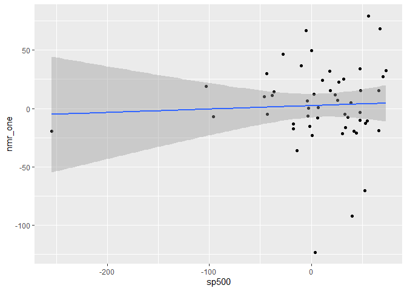<!-- -->

``` r
NMR_one_fit_real = lm(nmr_one~sp500,data=XSreal)
summary(NMR_one_fit_real)
```

    ## 
    ## Call:
    ## lm(formula = nmr_one ~ sp500, data = XSreal)
    ## 
    ## Residuals:
    ##      Min       1Q   Median       3Q      Max 
    ## -123.532  -15.036    0.048   19.248   73.496 
    ## 
    ## Coefficients:
    ##             Estimate Std. Error t value Pr(>|t|)
    ## (Intercept)  2.01668    4.85028   0.416    0.679
    ## sp500        0.03168    0.08901   0.356    0.723
    ## 
    ## Residual standard error: 34.56 on 50 degrees of freedom
    ## Multiple R-squared:  0.002527,   Adjusted R-squared:  -0.01742 
    ## F-statistic: 0.1267 on 1 and 50 DF,  p-value: 0.7234

``` r
ggplot(XSreal,aes(x=sp500,y=nmr_one))+
  geom_point()+
  geom_smooth(method="lm")
```

    ## `geom_smooth()` using formula = 'y ~ x'

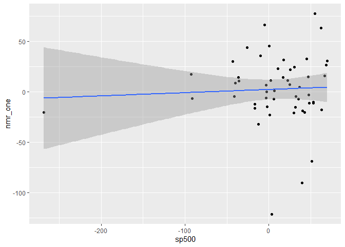<!-- -->

### Numerai Supreme

As of January 2024, there are still just a few observations for the
Numerai Supreme fund. We’ll build out this discussion as we get more
data. But for now, the beta estimates and $R^2$ values are similarly
small and insignificant. However, the alpha is quite negative suggesting
that the fund has struggled to deliver positive returns from its
market-neutral strategy.

``` r
NMR_sup_fit_nom = lm(nmr_sup~sp500,data=XSnom)
summary(NMR_sup_fit_nom)
```

    ## 
    ## Call:
    ## lm(formula = nmr_sup ~ sp500, data = XSnom)
    ## 
    ## Residuals:
    ##      Min       1Q   Median       3Q      Max 
    ## -141.865  -20.112    0.682   25.289  103.837 
    ## 
    ## Coefficients:
    ##             Estimate Std. Error t value Pr(>|t|)
    ## (Intercept) -8.78195   14.64055  -0.600    0.558
    ## sp500       -0.01183    0.31944  -0.037    0.971
    ## 
    ## Residual standard error: 59.22 on 15 degrees of freedom
    ##   (35 observations deleted due to missingness)
    ## Multiple R-squared:  9.138e-05,  Adjusted R-squared:  -0.06657 
    ## F-statistic: 0.001371 on 1 and 15 DF,  p-value: 0.971

``` r
ggplot(XSnom,aes(x=sp500,y=nmr_sup))+
  geom_point()+
  geom_smooth(method="lm")
```

    ## `geom_smooth()` using formula = 'y ~ x'

    ## Warning: Removed 35 rows containing non-finite values (`stat_smooth()`).

    ## Warning: Removed 35 rows containing missing values (`geom_point()`).

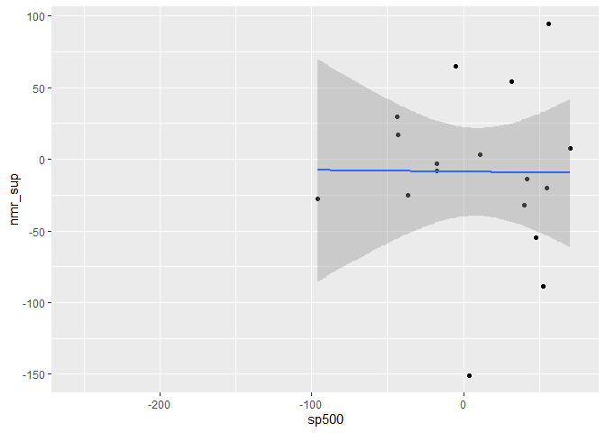<!-- -->

``` r
NMR_sup_fit_real = lm(nmr_sup~sp500,data=XSreal)
summary(NMR_sup_fit_real)
```

    ## 
    ## Call:
    ## lm(formula = nmr_sup ~ sp500, data = XSreal)
    ## 
    ## Residuals:
    ##     Min      1Q  Median      3Q     Max 
    ## -139.79  -19.54    0.98   23.94  101.78 
    ## 
    ## Coefficients:
    ##             Estimate Std. Error t value Pr(>|t|)
    ## (Intercept)  -8.6247    14.3640  -0.600    0.557
    ## sp500        -0.0187     0.3238  -0.058    0.955
    ## 
    ## Residual standard error: 58.06 on 15 degrees of freedom
    ##   (35 observations deleted due to missingness)
    ## Multiple R-squared:  0.0002223,  Adjusted R-squared:  -0.06643 
    ## F-statistic: 0.003335 on 1 and 15 DF,  p-value: 0.9547

``` r
ggplot(XSreal,aes(x=sp500,y=nmr_sup))+
  geom_point()+
  geom_smooth(method="lm")
```

    ## `geom_smooth()` using formula = 'y ~ x'

    ## Warning: Removed 35 rows containing non-finite values (`stat_smooth()`).
    ## Removed 35 rows containing missing values (`geom_point()`).

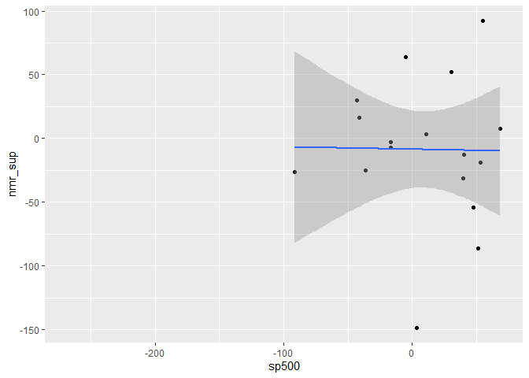<!-- -->

### Numeraire (NMR) token

For the NMR token, we get some interesting results with the negative
beta estimates, and the alpha estimates are quite large as well.
However, the $R^2$ values are very small. So the bigger take away is
that there isn’t much of a relationship here.

``` r
NMR_fit_nom = lm(NMR~sp500,data=XSnom)
summary(NMR_fit_nom)
```

    ## 
    ## Call:
    ## lm(formula = NMR ~ sp500, data = XSnom)
    ## 
    ## Residuals:
    ##     Min      1Q  Median      3Q     Max 
    ## -799.92 -233.35  -24.25  215.51 1180.12 
    ## 
    ## Coefficients:
    ##             Estimate Std. Error t value Pr(>|t|)
    ## (Intercept)  33.5976    50.7642   0.662    0.511
    ## sp500        -0.2415     0.9307  -0.259    0.796
    ## 
    ## Residual standard error: 361.2 on 50 degrees of freedom
    ## Multiple R-squared:  0.001345,   Adjusted R-squared:  -0.01863 
    ## F-statistic: 0.06732 on 1 and 50 DF,  p-value: 0.7963

``` r
ggplot(XSnom,aes(x=sp500,y=NMR))+
  geom_point()+
  geom_smooth(method="lm")
```

    ## `geom_smooth()` using formula = 'y ~ x'

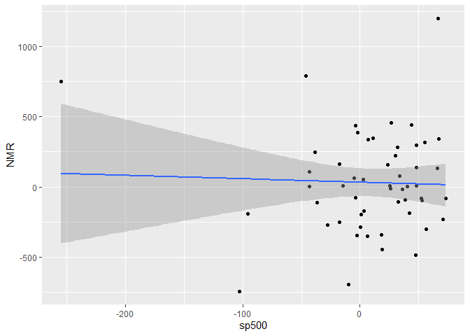<!-- -->

``` r
NMR_fit_real = lm(NMR~sp500,data=XSreal)
summary(NMR_fit_real)
```

    ## 
    ## Call:
    ## lm(formula = NMR ~ sp500, data = XSreal)
    ## 
    ## Residuals:
    ##     Min      1Q  Median      3Q     Max 
    ## -747.53 -230.86  -25.01  206.21 1131.00 
    ## 
    ## Coefficients:
    ##             Estimate Std. Error t value Pr(>|t|)
    ## (Intercept)  36.3087    48.2729   0.752    0.455
    ## sp500        -0.4662     0.8859  -0.526    0.601
    ## 
    ## Residual standard error: 343.9 on 50 degrees of freedom
    ## Multiple R-squared:  0.005508,   Adjusted R-squared:  -0.01438 
    ## F-statistic: 0.2769 on 1 and 50 DF,  p-value: 0.6011

``` r
ggplot(XSreal,aes(x=sp500,y=NMR))+
  geom_point()+
  geom_smooth(method="lm")
```

    ## `geom_smooth()` using formula = 'y ~ x'

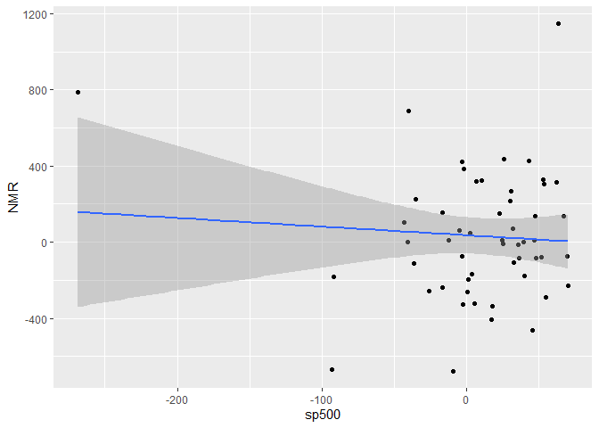<!-- -->

### Ether (ETH)

Ether produces a similarly large alpha estimate. However, the beta
estimate flips to a large, positive, and significant value. This
suggests that ETH has a large degree of systematic risk with a
reasonably strong relationship to the stock market. The \*\*\* in the
p-value column indicates that this beta estimate is significantly
different than 0 at the 1% level. However, a beta equal to 1 is also
meaningful to determine whether there is more systematic risk than the
market portfolio. Thus, you can subtract 1 from the beta estimate and
divide by the Std. Error to get a t-stat for the null hypothesis that
the beta is equal to 1.

``` r
ETH_fit_nom = lm(ETH~sp500,data=XSnom)
summary(ETH_fit_nom)
```

    ## 
    ## Call:
    ## lm(formula = ETH ~ sp500, data = XSnom)
    ## 
    ## Residuals:
    ##    Min     1Q Median     3Q    Max 
    ## -638.3 -183.3  -15.8  207.5  579.4 
    ## 
    ## Coefficients:
    ##             Estimate Std. Error t value Pr(>|t|)    
    ## (Intercept)  34.6541    36.6781   0.945 0.349296    
    ## sp500         2.5704     0.6724   3.822 0.000367 ***
    ## ---
    ## Signif. codes:  0 '***' 0.001 '**' 0.01 '*' 0.05 '.' 0.1 ' ' 1
    ## 
    ## Residual standard error: 261 on 50 degrees of freedom
    ## Multiple R-squared:  0.2261, Adjusted R-squared:  0.2107 
    ## F-statistic: 14.61 on 1 and 50 DF,  p-value: 0.0003669

``` r
ggplot(XSnom,aes(x=sp500,y=ETH))+
  geom_point()+
  geom_smooth(method="lm")
```

    ## `geom_smooth()` using formula = 'y ~ x'

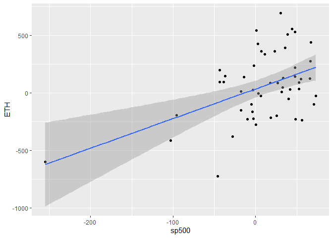<!-- -->

``` r
ETH_fit_real = lm(ETH~sp500,data=XSreal)
summary(ETH_fit_real)
```

    ## 
    ## Call:
    ## lm(formula = ETH ~ sp500, data = XSreal)
    ## 
    ## Residuals:
    ##    Min     1Q Median     3Q    Max 
    ## -566.6 -175.0  -16.2  203.3  562.5 
    ## 
    ## Coefficients:
    ##             Estimate Std. Error t value Pr(>|t|)    
    ## (Intercept)  36.1027    35.0752   1.029 0.308296    
    ## sp500         2.5278     0.6437   3.927 0.000264 ***
    ## ---
    ## Signif. codes:  0 '***' 0.001 '**' 0.01 '*' 0.05 '.' 0.1 ' ' 1
    ## 
    ## Residual standard error: 249.9 on 50 degrees of freedom
    ## Multiple R-squared:  0.2357, Adjusted R-squared:  0.2204 
    ## F-statistic: 15.42 on 1 and 50 DF,  p-value: 0.000264

``` r
ggplot(XSreal,aes(x=sp500,y=ETH))+
  geom_point()+
  geom_smooth(method="lm")
```

    ## `geom_smooth()` using formula = 'y ~ x'

<!-- -->

## Multi-Factor Models

Let’s try to incorporate some additional factors into the model to see
if we can improve the explanatory power.

### ETH-Factor Models

First, let’s try to incorporate the ETH risk premium as an additional
factor beyond the market risk premium.

``` r
nmr_one_fit2_nom = lm(nmr_one~sp500+ETH,data=XSnom)
summary(nmr_one_fit2_nom)
```

    ## 
    ## Call:
    ## lm(formula = nmr_one ~ sp500 + ETH, data = XSnom)
    ## 
    ## Residuals:
    ##      Min       1Q   Median       3Q      Max 
    ## -126.997  -12.939   -2.205   19.104   70.247 
    ## 
    ## Coefficients:
    ##             Estimate Std. Error t value Pr(>|t|)
    ## (Intercept)  3.28805    5.00774   0.657    0.515
    ## sp500        0.09853    0.10345   0.952    0.346
    ## ETH         -0.02685    0.01914  -1.403    0.167
    ## 
    ## Residual standard error: 35.32 on 49 degrees of freedom
    ## Multiple R-squared:  0.0406, Adjusted R-squared:  0.001438 
    ## F-statistic: 1.037 on 2 and 49 DF,  p-value: 0.3623

``` r
nmr_one_fit2_real = lm(nmr_one~sp500+ETH,data=XSreal)
summary(nmr_one_fit2_real)
```

    ## 
    ## Call:
    ## lm(formula = nmr_one ~ sp500 + ETH, data = XSreal)
    ## 
    ## Residuals:
    ##      Min       1Q   Median       3Q      Max 
    ## -124.911  -12.105   -1.956   18.397   65.199 
    ## 
    ## Coefficients:
    ##             Estimate Std. Error t value Pr(>|t|)
    ## (Intercept)  3.00543    4.85309   0.619    0.539
    ## sp500        0.10091    0.10082   1.001    0.322
    ## ETH         -0.02739    0.01936  -1.414    0.164
    ## 
    ## Residual standard error: 34.21 on 49 degrees of freedom
    ## Multiple R-squared:  0.04165,    Adjusted R-squared:  0.002537 
    ## F-statistic: 1.065 on 2 and 49 DF,  p-value: 0.3526

``` r
nmr_sup_fit2_nom = lm(nmr_sup~sp500+ETH,data=XSnom)
summary(nmr_sup_fit2_nom)
```

    ## 
    ## Call:
    ## lm(formula = nmr_sup ~ sp500 + ETH, data = XSnom)
    ## 
    ## Residuals:
    ##      Min       1Q   Median       3Q      Max 
    ## -143.667  -27.860   -2.151   39.215   84.252 
    ## 
    ## Coefficients:
    ##             Estimate Std. Error t value Pr(>|t|)
    ## (Intercept) -7.38686   14.95751  -0.494    0.629
    ## sp500       -0.01441    0.32395  -0.044    0.965
    ## ETH         -0.07756    0.10122  -0.766    0.456
    ## 
    ## Residual standard error: 60.05 on 14 degrees of freedom
    ##   (35 observations deleted due to missingness)
    ## Multiple R-squared:  0.04034,    Adjusted R-squared:  -0.09676 
    ## F-statistic: 0.2942 on 2 and 14 DF,  p-value: 0.7496

``` r
nmr_sup_fit2_real = lm(nmr_sup~sp500+ETH,data=XSreal)
summary(nmr_sup_fit2_real)
```

    ## 
    ## Call:
    ## lm(formula = nmr_sup ~ sp500 + ETH, data = XSreal)
    ## 
    ## Residuals:
    ##      Min       1Q   Median       3Q      Max 
    ## -141.678  -27.301   -0.849   37.880   81.416 
    ## 
    ## Coefficients:
    ##             Estimate Std. Error t value Pr(>|t|)
    ## (Intercept) -7.15439   14.64937  -0.488    0.633
    ## sp500       -0.02438    0.32774  -0.074    0.942
    ## ETH         -0.08322    0.10332  -0.805    0.434
    ## 
    ## Residual standard error: 58.75 on 14 degrees of freedom
    ##   (35 observations deleted due to missingness)
    ## Multiple R-squared:  0.0445, Adjusted R-squared:  -0.092 
    ## F-statistic: 0.326 on 2 and 14 DF,  p-value: 0.7271

``` r
NMR_fit2_nom = lm(NMR~sp500+ETH,data=XSnom)
summary(NMR_fit2_nom)
```

    ## 
    ## Call:
    ## lm(formula = NMR ~ sp500 + ETH, data = XSnom)
    ## 
    ## Residuals:
    ##     Min      1Q  Median      3Q     Max 
    ## -732.03 -188.64  -32.01  142.56 1153.72 
    ## 
    ## Coefficients:
    ##             Estimate Std. Error t value Pr(>|t|)  
    ## (Intercept)  20.6549    49.8160   0.415   0.6802  
    ## sp500        -1.2015     1.0291  -1.168   0.2486  
    ## ETH           0.3735     0.1904   1.962   0.0555 .
    ## ---
    ## Signif. codes:  0 '***' 0.001 '**' 0.01 '*' 0.05 '.' 0.1 ' ' 1
    ## 
    ## Residual standard error: 351.4 on 49 degrees of freedom
    ## Multiple R-squared:  0.07407,    Adjusted R-squared:  0.03627 
    ## F-statistic:  1.96 on 2 and 49 DF,  p-value: 0.1518

``` r
NMR_fit2_real = lm(NMR~sp500+ETH,data=XSreal)
summary(NMR_fit2_real)
```

    ## 
    ## Call:
    ## lm(formula = NMR ~ sp500 + ETH, data = XSreal)
    ## 
    ## Residuals:
    ##     Min      1Q  Median      3Q     Max 
    ## -679.22 -180.77  -33.54  156.54 1104.61 
    ## 
    ## Coefficients:
    ##             Estimate Std. Error t value Pr(>|t|)  
    ## (Intercept)  22.0182    47.1948   0.467   0.6429  
    ## sp500        -1.4668     0.9804  -1.496   0.1410  
    ## ETH           0.3958     0.1883   2.102   0.0407 *
    ## ---
    ## Signif. codes:  0 '***' 0.001 '**' 0.01 '*' 0.05 '.' 0.1 ' ' 1
    ## 
    ## Residual standard error: 332.7 on 49 degrees of freedom
    ## Multiple R-squared:  0.08777,    Adjusted R-squared:  0.05054 
    ## F-statistic: 2.357 on 2 and 49 DF,  p-value: 0.1053

### NMR-Factor Models

Then another factor we can try to incorporate into the model is the
various Numerai assets. In other words, let’s see if the NMR token
returns help explain the fund returns.

``` r
num_one_fit3_nom = lm(nmr_one~sp500+ETH+NMR,data=XSnom)
summary(num_one_fit3_nom)
```

    ## 
    ## Call:
    ## lm(formula = nmr_one ~ sp500 + ETH + NMR, data = XSnom)
    ## 
    ## Residuals:
    ##     Min      1Q  Median      3Q     Max 
    ## -128.82  -11.36   -0.55   19.35   72.61 
    ## 
    ## Coefficients:
    ##              Estimate Std. Error t value Pr(>|t|)
    ## (Intercept)  3.493537   5.043618   0.693    0.492
    ## sp500        0.086576   0.105442   0.821    0.416
    ## ETH         -0.023134   0.019983  -1.158    0.253
    ## NMR         -0.009949   0.014438  -0.689    0.494
    ## 
    ## Residual standard error: 35.51 on 48 degrees of freedom
    ## Multiple R-squared:  0.04999,    Adjusted R-squared:  -0.009382 
    ## F-statistic: 0.842 on 3 and 48 DF,  p-value: 0.4776

``` r
num_one_fit3_real = lm(nmr_one~sp500+ETH+NMR,data=XSreal)
summary(num_one_fit3_real)
```

    ## 
    ## Call:
    ## lm(formula = nmr_one ~ sp500 + ETH + NMR, data = XSreal)
    ## 
    ## Residuals:
    ##      Min       1Q   Median       3Q      Max 
    ## -126.755  -10.830   -0.456   17.753   67.476 
    ## 
    ## Coefficients:
    ##             Estimate Std. Error t value Pr(>|t|)
    ## (Intercept)  3.22905    4.89023   0.660    0.512
    ## sp500        0.08602    0.10365   0.830    0.411
    ## ETH         -0.02337    0.02033  -1.150    0.256
    ## NMR         -0.01016    0.01477  -0.688    0.495
    ## 
    ## Residual standard error: 34.4 on 48 degrees of freedom
    ## Multiple R-squared:  0.051,  Adjusted R-squared:  -0.008311 
    ## F-statistic: 0.8599 on 3 and 48 DF,  p-value: 0.4684

``` r
num_sup_fit3_nom = lm(nmr_sup~sp500+ETH+NMR,data=XSnom)
summary(num_sup_fit3_nom)
```

    ## 
    ## Call:
    ## lm(formula = nmr_sup ~ sp500 + ETH + NMR, data = XSnom)
    ## 
    ## Residuals:
    ##     Min      1Q  Median      3Q     Max 
    ## -125.23  -36.14   21.14   29.82   93.70 
    ## 
    ## Coefficients:
    ##             Estimate Std. Error t value Pr(>|t|)
    ## (Intercept) -4.02055   14.69477  -0.274    0.789
    ## sp500       -0.06100    0.31566  -0.193    0.850
    ## ETH         -0.20048    0.13233  -1.515    0.154
    ## NMR          0.13168    0.09518   1.383    0.190
    ## 
    ## Residual standard error: 58.18 on 13 degrees of freedom
    ##   (35 observations deleted due to missingness)
    ## Multiple R-squared:  0.1635, Adjusted R-squared:  -0.02954 
    ## F-statistic: 0.847 on 3 and 13 DF,  p-value: 0.4925

``` r
num_sup_fit3_real = lm(nmr_sup~sp500+ETH+NMR,data=XSreal)
summary(num_sup_fit3_real)
```

    ## 
    ## Call:
    ## lm(formula = nmr_sup ~ sp500 + ETH + NMR, data = XSreal)
    ## 
    ## Residuals:
    ##     Min      1Q  Median      3Q     Max 
    ## -123.02  -35.59   21.97   29.65   90.99 
    ## 
    ## Coefficients:
    ##             Estimate Std. Error t value Pr(>|t|)
    ## (Intercept) -3.80625   14.36439  -0.265    0.795
    ## sp500       -0.07091    0.31864  -0.223    0.827
    ## ETH         -0.20836    0.13386  -1.557    0.144
    ## NMR          0.13490    0.09603   1.405    0.184
    ## 
    ## Residual standard error: 56.81 on 13 degrees of freedom
    ##   (35 observations deleted due to missingness)
    ## Multiple R-squared:  0.1704, Adjusted R-squared:  -0.02102 
    ## F-statistic: 0.8902 on 3 and 13 DF,  p-value: 0.4721

### Fama/French Research Factors

A popular asset pricing model in the finance literature has been the
factor models from [Fama and French
(1993)](https://doi.org/10.1016/0304-405X(93)90023-5), which introduced
a three-factor model that includes SMB (Small Minus Big) as a ‘size’
factor and HML (High Minus Low) as a ‘value’/‘growth’ factor. See [the
3-Factors
webpage](https://mba.tuck.dartmouth.edu/pages/faculty/ken.french/Data_Library/f-f_factors.html)
for more detail. Additionally the more recent [Fama and French
(2015)](https://doi.org/10.1016/j.jfineco.2014.10.010) includes two
additional factors: RMW (Robust Minus Weak) as a ‘profitability’ factor
and CMA (Conservative Minus Aggressive) factor. The [5-Factors
webpage](https://mba.tuck.dartmouth.edu/pages/faculty/ken.french/Data_Library/f-f_5_factors_2x3.html)
has more detail. The codes below import the factor data from the website
and conduct those regressions on the Numerai returns.

``` r
ff3url = "https://mba.tuck.dartmouth.edu/pages/faculty/ken.french/ftp/F-F_Research_Data_Factors_CSV.zip"
# Create subdirectory for file downloads
subdirectory = "Factor Data"
dir.create(subdirectory, showWarnings=FALSE)
# Define the file paths
zip_filepath = file.path(subdirectory, "FF3-factors.zip")
csv_filepath = file.path(subdirectory, "FF3-factors.csv")
# Download the zip file
download.file(ff3url, destfile=zip_filepath)
# Extract the CSV file from the zip file
unzip(zip_filepath, exdir=subdirectory)
file.rename("Factor Data/F-F_Research_Data_Factors.CSV", csv_filepath)
```

    ## [1] TRUE

``` r
FF3 = read_csv(csv_filepath,
               col_types = cols(...1 = col_date(format = "%Y%m")), 
               skip = 2)
```

    ## New names:
    ## • `` -> `...1`

    ## Warning: One or more parsing issues, call `problems()` on your data frame for details,
    ## e.g.:
    ##   dat <- vroom(...)
    ##   problems(dat)

``` r
FF3 = FF3 |> rename(Date=...1)
# Trim annual observations from bottom of date frame (dates import as missing)
FF3 = FF3[complete.cases(FF3),]
# Reformat to xts object
FF3xts = xts(FF3[,-1], order.by=FF3$Date)
# Remove data prior to first BTC observation
FF3xts = FF3xts[paste(startdate,"/",sep="")]
```

``` r
# Compile data frame of annualized crypto returns (un-annualize)
assets_ff3 = merge(XSreal,
                   FF3xts*12)
#assets_ff3 = assets_ff3[complete.cases(assets_ff3),]
# Compute average annual returns, volatility, and correlations
Er_ff3 = colMeans(assets_ff3,na.rm=TRUE)
Er_ff3 |> round(2)
```

    ##   sp500 nmr_one nmr_sup     NMR     ETH  Mkt.RF     SMB     HML      RF 
    ##    8.42    2.28   -8.79   32.38   57.39   11.84   -0.69   -0.27    1.61

``` r
sd_ff3 = apply(assets_ff3,2,sd,na.rm=TRUE)
sd_ff3 |> round(2)
```

    ##   sp500 nmr_one nmr_sup     NMR     ETH  Mkt.RF     SMB     HML      RF 
    ##   54.36   34.26   56.22  341.47  283.02   69.21   35.33   58.88    1.97

``` r
Sharpe_ff3 = Er_ff3/sd_ff3
Sharpe_ff3 |> round(2)
```

    ##   sp500 nmr_one nmr_sup     NMR     ETH  Mkt.RF     SMB     HML      RF 
    ##    0.15    0.07   -0.16    0.09    0.20    0.17   -0.02    0.00    0.82

``` r
cor(assets_ff3, use="pairwise.complete.obs") |> round(2)
```

    ##         sp500 nmr_one nmr_sup   NMR   ETH Mkt.RF   SMB   HML    RF
    ## sp500    1.00    0.05   -0.01 -0.07  0.49   0.58  0.36  0.16 -0.07
    ## nmr_one  0.05    1.00    0.88 -0.15 -0.15  -0.10 -0.17  0.20 -0.26
    ## nmr_sup -0.01    0.88    1.00  0.12 -0.21  -0.21 -0.28  0.41 -0.22
    ## NMR     -0.07   -0.15    0.12  1.00  0.21   0.07  0.10 -0.27 -0.01
    ## ETH      0.49   -0.15   -0.21  0.21  1.00   0.64  0.32  0.00 -0.13
    ## Mkt.RF   0.58   -0.10   -0.21  0.07  0.64   1.00  0.31  0.03 -0.07
    ## SMB      0.36   -0.17   -0.28  0.10  0.32   0.31  1.00  0.01 -0.17
    ## HML      0.16    0.20    0.41 -0.27  0.00   0.03  0.01  1.00 -0.15
    ## RF      -0.07   -0.26   -0.22 -0.01 -0.13  -0.07 -0.17 -0.15  1.00

``` r
# FF3 regressions
FF3reg_nmr_one = lm(nmr_one~Mkt.RF+SMB+HML, data=assets_ff3)
summary(FF3reg_nmr_one)
```

    ## 
    ## Call:
    ## lm(formula = nmr_one ~ Mkt.RF + SMB + HML, data = assets_ff3)
    ## 
    ## Residuals:
    ##      Min       1Q   Median       3Q      Max 
    ## -110.248  -16.125   -2.204   22.471   67.410 
    ## 
    ## Coefficients:
    ##             Estimate Std. Error t value Pr(>|t|)
    ## (Intercept)  2.93047    4.99369   0.587    0.560
    ## Mkt.RF      -0.02776    0.07523  -0.369    0.714
    ## SMB         -0.15330    0.14734  -1.040    0.304
    ## HML          0.11882    0.08422   1.411    0.165
    ## 
    ## Residual standard error: 34.7 on 46 degrees of freedom
    ##   (2 observations deleted due to missingness)
    ## Multiple R-squared:  0.07148,    Adjusted R-squared:  0.01092 
    ## F-statistic:  1.18 on 3 and 46 DF,  p-value: 0.3276

``` r
FF3reg_nmr_sup = lm(nmr_sup~Mkt.RF+SMB+HML, data=assets_ff3)
summary(FF3reg_nmr_sup)
```

    ## 
    ## Call:
    ## lm(formula = nmr_sup ~ Mkt.RF + SMB + HML, data = assets_ff3)
    ## 
    ## Residuals:
    ##    Min     1Q Median     3Q    Max 
    ## -79.65 -32.55 -12.39  23.74  81.35 
    ## 
    ## Coefficients:
    ##             Estimate Std. Error t value Pr(>|t|)  
    ## (Intercept)  -9.2074    14.1687  -0.650   0.5280  
    ## Mkt.RF       -0.1603     0.2212  -0.725   0.4824  
    ## SMB          -0.4716     0.4343  -1.086   0.2989  
    ## HML           0.5380     0.2910   1.849   0.0893 .
    ## ---
    ## Signif. codes:  0 '***' 0.001 '**' 0.01 '*' 0.05 '.' 0.1 ' ' 1
    ## 
    ## Residual standard error: 54.28 on 12 degrees of freedom
    ##   (36 observations deleted due to missingness)
    ## Multiple R-squared:  0.2994, Adjusted R-squared:  0.1242 
    ## F-statistic: 1.709 on 3 and 12 DF,  p-value: 0.2181

``` r
FF3reg_NMR = lm(NMR~Mkt.RF+SMB+HML, data=assets_ff3)
summary(FF3reg_NMR)
```

    ## 
    ## Call:
    ## lm(formula = NMR ~ Mkt.RF + SMB + HML, data = assets_ff3)
    ## 
    ## Residuals:
    ##    Min     1Q Median     3Q    Max 
    ## -741.2 -207.4    1.4  194.7 1031.2 
    ## 
    ## Coefficients:
    ##             Estimate Std. Error t value Pr(>|t|)  
    ## (Intercept)  26.4781    49.1246   0.539   0.5925  
    ## Mkt.RF        0.2804     0.7400   0.379   0.7066  
    ## SMB           0.7834     1.4494   0.540   0.5915  
    ## HML          -1.5895     0.8285  -1.919   0.0612 .
    ## ---
    ## Signif. codes:  0 '***' 0.001 '**' 0.01 '*' 0.05 '.' 0.1 ' ' 1
    ## 
    ## Residual standard error: 341.3 on 46 degrees of freedom
    ##   (2 observations deleted due to missingness)
    ## Multiple R-squared:  0.08446,    Adjusted R-squared:  0.02475 
    ## F-statistic: 1.415 on 3 and 46 DF,  p-value: 0.2506

``` r
FF3reg_ETH = lm(ETH~Mkt.RF+SMB+HML, data=assets_ff3)
summary(FF3reg_ETH)
```

    ## 
    ## Call:
    ## lm(formula = ETH ~ Mkt.RF + SMB + HML, data = assets_ff3)
    ## 
    ## Residuals:
    ##     Min      1Q  Median      3Q     Max 
    ## -440.45 -133.65   11.65  111.46  553.63 
    ## 
    ## Coefficients:
    ##             Estimate Std. Error t value Pr(>|t|)    
    ## (Intercept) 27.48429   32.46555   0.847    0.402    
    ## Mkt.RF       2.50180    0.48908   5.115 5.96e-06 ***
    ## SMB          1.09257    0.95789   1.141    0.260    
    ## HML         -0.08988    0.54751  -0.164    0.870    
    ## ---
    ## Signif. codes:  0 '***' 0.001 '**' 0.01 '*' 0.05 '.' 0.1 ' ' 1
    ## 
    ## Residual standard error: 225.6 on 46 degrees of freedom
    ##   (2 observations deleted due to missingness)
    ## Multiple R-squared:  0.4265, Adjusted R-squared:  0.3891 
    ## F-statistic:  11.4 on 3 and 46 DF,  p-value: 1.03e-05

``` r
ff5url = "https://mba.tuck.dartmouth.edu/pages/faculty/ken.french/ftp/F-F_Research_Data_5_Factors_2x3_CSV.zip"
# Define the file paths
zip_filepath = file.path(subdirectory, "FF5-factors.zip")
csv_filepath = file.path(subdirectory, "FF5-factors.csv")
# Download the zip file
download.file(ff5url, destfile=zip_filepath)
# Extract the CSV file from the zip file
unzip(zip_filepath, exdir=subdirectory)
file.rename("Factor Data/F-F_Research_Data_5_Factors_2x3.CSV", csv_filepath)
```

    ## [1] TRUE

``` r
FF5 = read_csv(csv_filepath,
               col_types = cols(...1 = col_date(format = "%Y%m")), 
               skip = 2)
```

    ## New names:
    ## • `` -> `...1`

    ## Warning: One or more parsing issues, call `problems()` on your data frame for details,
    ## e.g.:
    ##   dat <- vroom(...)
    ##   problems(dat)

``` r
FF5 = FF5 |> rename(Date=...1)
# Trim annual observations from bottom of date frame (dates import as missing)
FF5 = FF5[complete.cases(FF5),]
# For some reason, the factors are importing as characters, so this will fix those
FF5$`Mkt-RF` = as.numeric(FF5$`Mkt-RF`)*12
FF5$SMB = as.numeric(FF5$SMB)*12
FF5$HML = as.numeric(FF5$HML)*12
FF5$RMW = as.numeric(FF5$RMW)*12
FF5$CMA = as.numeric(FF5$CMA)*12
# Reformat to xts object
FF5xts = xts(FF5[,-1], order.by=FF5$Date)
# Remove data prior to first BTC observation
FF5xts = FF5xts[paste(startdate,"/",sep="")]
```

``` r
# Compile data frame of annualized crypto returns (un-annualize)
assets_ff5 = merge(XSreal, FF5xts)
#assets_ff5 = assets_ff5[complete.cases(assets_ff5),]
# Compute average annual returns, volatility, and correlations
Er_ff5 = colMeans(assets_ff5,na.rm=TRUE)
Er_ff5 |> round(2)
```

    ##   sp500 nmr_one nmr_sup     NMR     ETH  Mkt.RF     SMB     HML     RMW     CMA 
    ##    8.42    2.28   -8.79   32.38   57.39   11.84   -1.08   -0.27    8.40    2.14 
    ##      RF 
    ##    0.13

``` r
sd_ff5 = apply(assets_ff5,2,sd,na.rm=TRUE)
sd_ff5 |> round(2)
```

    ##   sp500 nmr_one nmr_sup     NMR     ETH  Mkt.RF     SMB     HML     RMW     CMA 
    ##   54.36   34.26   56.22  341.47  283.02   69.21   37.99   58.88   33.05   38.19 
    ##      RF 
    ##    0.16

``` r
Sharpe_ff5 = Er_ff5/sd_ff5
Sharpe_ff5 |> round(2)
```

    ##   sp500 nmr_one nmr_sup     NMR     ETH  Mkt.RF     SMB     HML     RMW     CMA 
    ##    0.15    0.07   -0.16    0.09    0.20    0.17   -0.03    0.00    0.25    0.06 
    ##      RF 
    ##    0.82

``` r
cor(assets_ff5, use="pairwise.complete.obs") |> round(2)
```

    ##         sp500 nmr_one nmr_sup   NMR   ETH Mkt.RF   SMB   HML   RMW   CMA    RF
    ## sp500    1.00    0.05   -0.01 -0.07  0.49   0.58  0.41  0.16  0.08 -0.14 -0.07
    ## nmr_one  0.05    1.00    0.88 -0.15 -0.15  -0.10 -0.07  0.20  0.12  0.26 -0.26
    ## nmr_sup -0.01    0.88    1.00  0.12 -0.21  -0.21 -0.10  0.41  0.41  0.63 -0.22
    ## NMR     -0.07   -0.15    0.12  1.00  0.21   0.07  0.02 -0.27  0.02 -0.22 -0.01
    ## ETH      0.49   -0.15   -0.21  0.21  1.00   0.64  0.30  0.00 -0.04 -0.19 -0.13
    ## Mkt.RF   0.58   -0.10   -0.21  0.07  0.64   1.00  0.33  0.03  0.10 -0.18 -0.07
    ## SMB      0.41   -0.07   -0.10  0.02  0.30   0.33  1.00  0.32 -0.38 -0.01 -0.20
    ## HML      0.16    0.20    0.41 -0.27  0.00   0.03  0.32  1.00  0.20  0.67 -0.15
    ## RMW      0.08    0.12    0.41  0.02 -0.04   0.10 -0.38  0.20  1.00  0.19 -0.03
    ## CMA     -0.14    0.26    0.63 -0.22 -0.19  -0.18 -0.01  0.67  0.19  1.00 -0.21
    ## RF      -0.07   -0.26   -0.22 -0.01 -0.13  -0.07 -0.20 -0.15 -0.03 -0.21  1.00

``` r
# FF3 regressions
FF5reg_nmr_one = lm(nmr_one~Mkt.RF+SMB+HML+RMW+CMA, data=assets_ff5)
summary(FF5reg_nmr_one)
```

    ## 
    ## Call:
    ## lm(formula = nmr_one ~ Mkt.RF + SMB + HML + RMW + CMA, data = assets_ff5)
    ## 
    ## Residuals:
    ##      Min       1Q   Median       3Q      Max 
    ## -103.113  -19.878    0.935   23.436   65.221 
    ## 
    ## Coefficients:
    ##             Estimate Std. Error t value Pr(>|t|)
    ## (Intercept)  2.09062    5.25736   0.398    0.693
    ## Mkt.RF      -0.02655    0.08275  -0.321    0.750
    ## SMB         -0.04984    0.18386  -0.271    0.788
    ## HML          0.04841    0.13613   0.356    0.724
    ## RMW          0.05911    0.18745   0.315    0.754
    ## CMA          0.16999    0.19029   0.893    0.377
    ## 
    ## Residual standard error: 35.3 on 44 degrees of freedom
    ##   (2 observations deleted due to missingness)
    ## Multiple R-squared:  0.08044,    Adjusted R-squared:  -0.02405 
    ## F-statistic: 0.7698 on 5 and 44 DF,  p-value: 0.5766

``` r
FF5reg_nmr_sup = lm(nmr_sup~Mkt.RF+SMB+HML+RMW+CMA, data=assets_ff5)
summary(FF5reg_nmr_sup)
```

    ## 
    ## Call:
    ## lm(formula = nmr_sup ~ Mkt.RF + SMB + HML + RMW + CMA, data = assets_ff5)
    ## 
    ## Residuals:
    ##     Min      1Q  Median      3Q     Max 
    ## -68.791 -27.624   1.906  25.852  66.166 
    ## 
    ## Coefficients:
    ##             Estimate Std. Error t value Pr(>|t|)
    ## (Intercept)  -5.9507    13.0824  -0.455    0.659
    ## Mkt.RF       -0.2574     0.2136  -1.205    0.256
    ## SMB           0.3559     0.5793   0.614    0.553
    ## HML          -0.3048     0.5179  -0.589    0.569
    ## RMW           0.5361     0.4957   1.081    0.305
    ## CMA           1.0115     0.5667   1.785    0.105
    ## 
    ## Residual standard error: 49.37 on 10 degrees of freedom
    ##   (36 observations deleted due to missingness)
    ## Multiple R-squared:  0.517,  Adjusted R-squared:  0.2754 
    ## F-statistic:  2.14 on 5 and 10 DF,  p-value: 0.1432

``` r
FF5reg_NMR = lm(NMR~Mkt.RF+SMB+HML+RMW+CMA, data=assets_ff5)
summary(FF5reg_NMR)
```

    ## 
    ## Call:
    ## lm(formula = NMR ~ Mkt.RF + SMB + HML + RMW + CMA, data = assets_ff5)
    ## 
    ## Residuals:
    ##     Min      1Q  Median      3Q     Max 
    ## -732.25 -234.44   23.13  190.49  970.80 
    ## 
    ## Coefficients:
    ##             Estimate Std. Error t value Pr(>|t|)
    ## (Intercept) 15.76457   51.32189   0.307    0.760
    ## Mkt.RF      -0.01258    0.80777  -0.016    0.988
    ## SMB          1.86356    1.79484   1.038    0.305
    ## HML         -2.16706    1.32886  -1.631    0.110
    ## RMW          1.84896    1.82992   1.010    0.318
    ## CMA         -0.01642    1.85759  -0.009    0.993
    ## 
    ## Residual standard error: 344.6 on 44 degrees of freedom
    ##   (2 observations deleted due to missingness)
    ## Multiple R-squared:  0.1072, Adjusted R-squared:  0.005693 
    ## F-statistic: 1.056 on 5 and 44 DF,  p-value: 0.3975

``` r
FF5reg_ETH = lm(ETH~Mkt.RF+SMB+HML+RMW+CMA, data=assets_ff5)
summary(FF5reg_ETH)
```

    ## 
    ## Call:
    ## lm(formula = ETH ~ Mkt.RF + SMB + HML + RMW + CMA, data = assets_ff5)
    ## 
    ## Residuals:
    ##     Min      1Q  Median      3Q     Max 
    ## -422.66 -136.81   17.84  131.91  615.59 
    ## 
    ## Coefficients:
    ##             Estimate Std. Error t value Pr(>|t|)    
    ## (Intercept)  33.9538    34.2669   0.991    0.327    
    ## Mkt.RF        2.5575     0.5393   4.742 2.25e-05 ***
    ## SMB           0.3508     1.1984   0.293    0.771    
    ## HML           0.2425     0.8873   0.273    0.786    
    ## RMW          -0.6925     1.2218  -0.567    0.574    
    ## CMA          -0.7514     1.2403  -0.606    0.548    
    ## ---
    ## Signif. codes:  0 '***' 0.001 '**' 0.01 '*' 0.05 '.' 0.1 ' ' 1
    ## 
    ## Residual standard error: 230.1 on 44 degrees of freedom
    ##   (2 observations deleted due to missingness)
    ## Multiple R-squared:  0.4292, Adjusted R-squared:  0.3643 
    ## F-statistic: 6.616 on 5 and 44 DF,  p-value: 0.0001136
